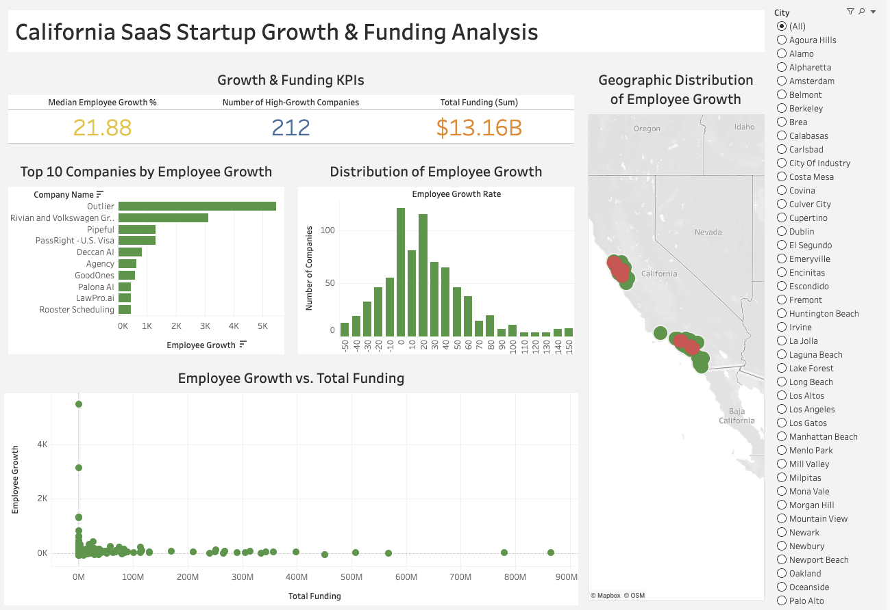
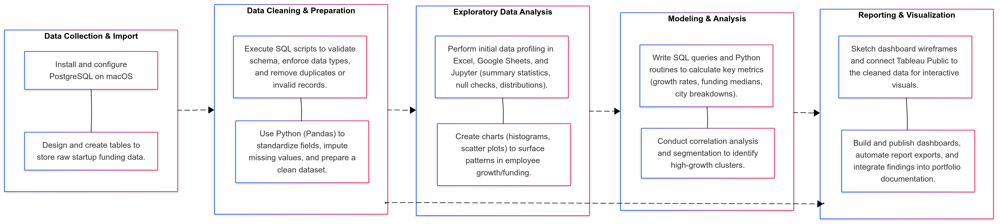
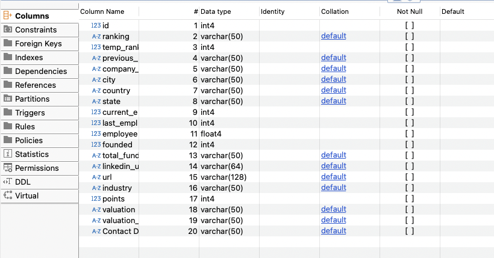
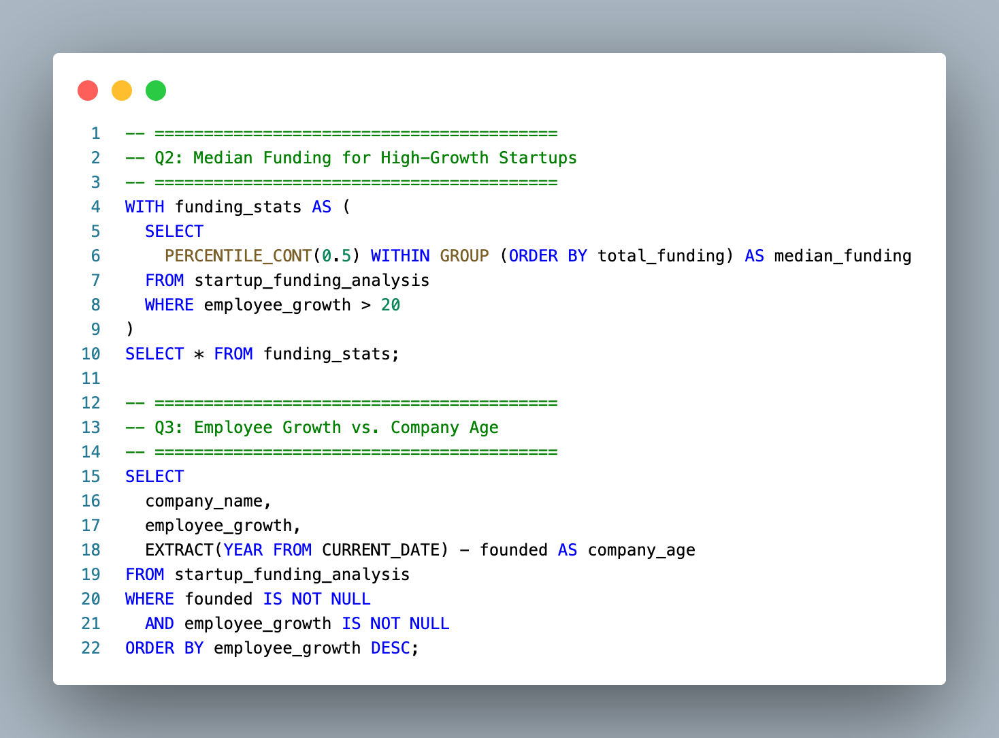
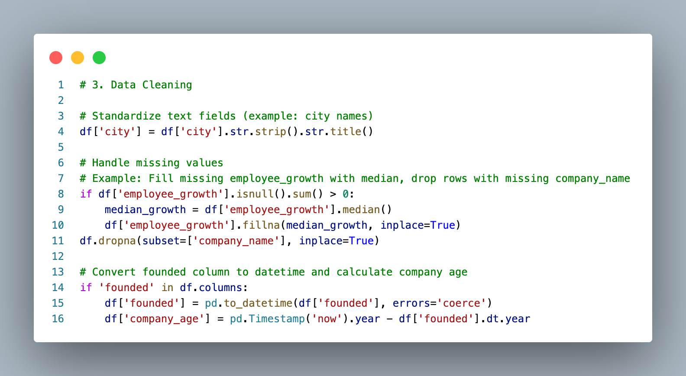
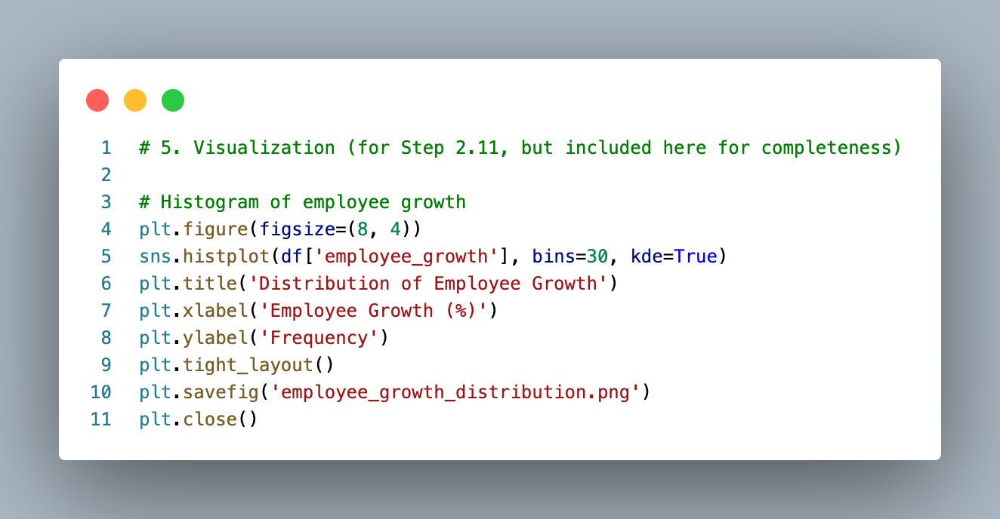

<h1 align="center">California SaaS Startup Growth & Funding Analysis</h1>
<h2 align="center">Business Impact Questions & Results</h2>

| Question                                                                                                 | Key Result                                                                                                                         |
|:-------------------------------------------------------------------------------------------------------- |:-----------------------------------------------------------------------------------------------------------------------------------|
| 📈 **Highest-Growth Investment Opportunities** Which California SaaS companies represent the highest-growth investment opportunities? | 🏆 **212 high-growth companies identified** from 800+ dataset Top 10 performers include Outlier, Rivian & Volkswagen Group, Pipeful, PassRight—providing VCs with quantifiable screening criteria |
| ⚙️ **Competitive Benchmarking** What are the performance benchmarks for competitive positioning?       | 📊 **Median employee growth: 21.88%** established as market standard Distribution spans –50% to 150%+ enabling strategic positioning against verified benchmarks                                                               |
| 🌐 **Geographic Clusters** Where are the geographic clusters of high-performing SaaS companies?        | 📍 **San Francisco Bay Area, Los Angeles, San Diego** identified as top growth hubs Provides critical intelligence for regional investment strategies and market dynamics                                                                            |
| 💰 **Funding vs. Growth Correlation** How do funding levels correlate with growth performance?         | 🔗 **Interactive correlation analysis across 800+ companies** Total funding: **$13.16 B** reveals capital efficiency patterns for optimal investment decisions                                                                  |

<h2 align="center">🛠️ Technologies Used</h2>

<h2 align="center">🚀 Live Dashboard</h2>

  <a href="https://public.tableau.com/app/profile/farooq.syed6811/viz/CaliforniaSaaSStartupGrowthFundingAnalysis_17511350716100/CaliforniaSaaSStartupGrowthFundingAnalysis?publish=yes">
    View the Interactive Tableau Dashboard
  </a>

  

<h2 align="center">🗺️ Project Workflow</h2>

<h2 align="center">📖  Technical Documentation</h2>

| Data Model Design & Schema Architecture                            | SQL Business Queries                                 |
|:------------------------------------------------------------------:|:----------------------------------------------------:|
|  |  |

| Python Data Cleaning                                               | Python Visualization                                 |
|:------------------------------------------------------------------:|:----------------------------------------------------:|
|  |  |

# Supporting Resources

- **Business Impact Results**  
  [`business-impact-results.md`](./business-impact-results.md)  
  *A detailed analysis of how funding trends have influenced business outcomes for SaaS startups in California, featuring key metrics, growth benchmarks, and the impact of capital availability on company performance.*

- **Executive Summary**  
  [`executive-summary.md`](./executive-summary.md)  
  *An overview highlighting the main findings, strategic insights, and key takeaways from the California SaaS Startup Growth & Funding Analysis, providing a concise snapshot of trends, challenges, and opportunities in the sector.*

- **Process**  
  [`process.md`](./process.md)  
  *A step-by-step documentation of the research and analytical methods used in the California SaaS Startup Growth & Funding Analysis, detailing data collection, processing, and evaluation procedures.*

- **Technical Documentation**  
  [`technical-documentation.md`](./technical-documentation.md)  
  *Comprehensive technical reference outlining the project’s infrastructure, tools, and implementation details for the California SaaS Startup Growth & Funding Analysis.*

- **Python Data Cleaning & Analysis Notebook**  
  [`src/python_cleaning_analysis.ipynb`](./src/python_cleaning_analysis.ipynb)  
  *Jupyter notebook containing the Python code for data cleaning, transformation, and core analytical workflows used in the project.*

- **Business Analysis SQL Queries**  
  [`src/business_analysis_queries.sql`](./src/business_analysis_queries.sql)  
  *A collection of SQL queries used for extracting, transforming, and analyzing business data within the project. These queries support key business questions and deliver actionable insights for SaaS startup growth and funding analysis.*

