# California SaaS Startup Growth & Funding Analysis – Labs Mode Documentation

## Table of Contents
- [Week 1: Data Acquisition & Exploration](#week-1-data-acquisition--exploration)
- [Week 2: Data Cleaning & SQL Analysis](#week-2-data-cleaning--sql-analysis)
- [Week 3: Visualization & Dashboard Design](#week-3-visualization--dashboard-design)
- [Week 4: Documentation, Publishing, and Portfolio Prep](#week-4-documentation-publishing-and-portfolio-prep)
- [Key Metrics and KPI Selection](#key-metrics-and-kpi-selection)
- [Screenshot Reference Table](#screenshot-reference-table)
- [Supporting Documentation](#supporting-documentation)

---

## Week 1: Data Acquisition & Exploration

### 1.1 Install and configure PostgreSQL on your Mac  
**Q:** What installation challenges did you encounter? Which configuration settings optimized performance for your project?  
**A:** Successfully installed PostgreSQL using official installer. Configured default port 5432, set up authentication. Tuned shared buffers and workmem.  

### 1.2 Design table structure for funding data  
**Q:** How did you determine optimal data types and constraints? What normalization decisions did you make and why?  
**A:** Used VARCHAR for names, TEXT for URLs, INTEGER for counts, DECIMAL for growth. Minimal normalization for simplicity, enforced NOT NULL on key fields.  

### 1.3 Research and download a free startup funding dataset  
**Q:** What criteria guided your dataset selection? How did you validate data quality and relevance for your analysis goals?  
**A:** Chose Growjo for SaaS focus and growth metrics. Filtered for CA companies and 1-500 employees. Checked completeness of key variables.  
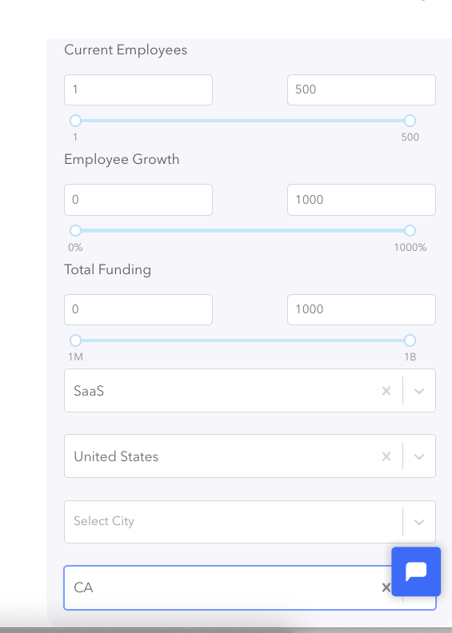

### 1.4 Load data into Excel for initial exploration  
**Q:** What data formatting issues did you discover? How did you handle missing values and inconsistent data types?  
**A:** Found inconsistencies in names and locations. 67 missing funding, 20 missing founded dates. Used Excel validation and conditional formatting.  
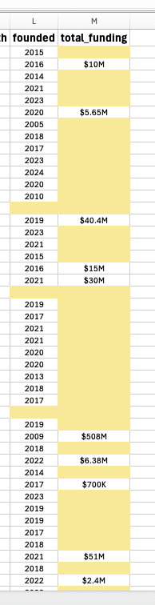

### 1.5 Identify key variables and check data quality  
**Q:** What percentage of data was complete for each key variable? Which quality issues required strategic analytical pivots?  
**A:** Company names 100%, employees 99.5%, growth 98.8%, funding 32.9%. Pivoted to employee growth analysis due to missing funding data.  
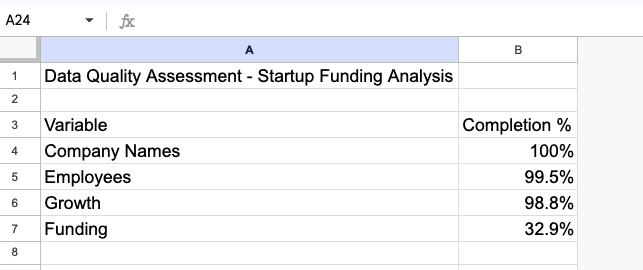

### 1.6 Define 3-4 core business impact questions  
**Q:** How did your data quality assessment inform your business questions? What stakeholder value do these questions address?  
**A:** Focused on employee growth questions supported by high-quality data. Questions address SaaS scaling, company age, geography, and growth stages.  

---

## Week 2: Data Cleaning & SQL Analysis

### 2.7 Import cleaned dataset into PostgreSQL  
**Q:** What import challenges did you resolve? How did you optimize table structure for analytical performance?  
**A:** Fixed VARCHAR length errors in DBeaver by switching to TEXT for URL columns. Ensured all columns matched the cleaned CSV. Optimized data types. Removed obsolete table newtable after confirming all work references startupfundinganalysis. Ran DROP TABLE IF EXISTS newtable for cleanup.  
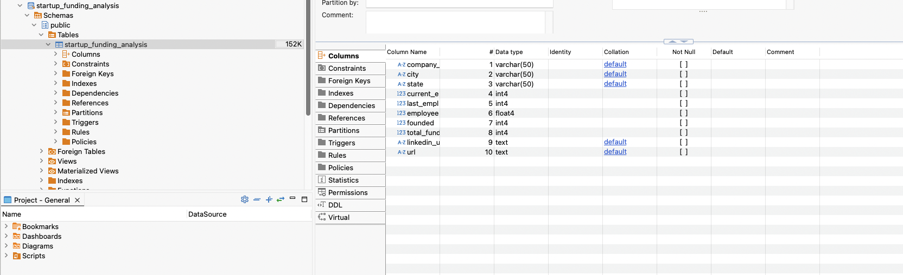

### 2.8 Test basic SQL queries  
**Q:** What specific validation queries did you run? What were the exact results (row counts, data ranges)? Which outliers did you discover and how did you handle them?  
**A:** Ran row count, null checks, min/max, uniqueness, funding statistics, and duplicate checks. Results: Row count matched CSV, minimal nulls in key columns, realistic funding and employee ranges, no problematic duplicates.  

### 2.9 Write SQL queries to answer business questions  
**Q:** What were your exact SQL queries for each business impact question? What performance optimizations did you implement? What unexpected patterns did you discover in the data?  
**A:** Drafted queries for employee growth, funding by location, and company age distribution. Discovered a few high-funding outliers and adjusted analysis to use median and percentiles.  
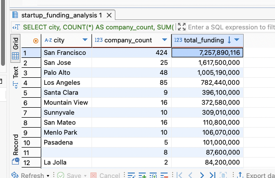

### 2.10 Use Python Pandas for further cleaning  
**Q:** Which data quality issues did Python reveal that SQL missed? What transformation logic did you apply? What statistical insights emerged?  
**A:** Updated all .fillna operations to assign directly to DataFrame columns (e.g., df['employeegrowth'] = df['employeegrowth'].fillna(mediangrowth)) instead of using inplace=True. Completed data cleaning steps: standardized text fields, handled missing values, converted date columns, removed duplicates, and calculated company age.  
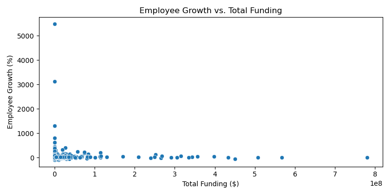

### 2.11 Create simple visualizations to validate insights  
**Q:** Which visualization types best represented your findings? What design decisions did you make and why? How did visuals change your analytical conclusions?  
**A:** Created histogram for employee growth distribution and scatter plot for employee growth vs. total funding. Key findings: histogram revealed most companies have moderate employee growth, a few extreme outliers; scatter plot showed most companies cluster at lower funding/growth, with outliers. Visuals validated main patterns.  

### 2.12 Set up Python Anaconda Jupyter Notebook  
**Q:** What configuration challenges did you encounter? Which libraries did you install beyond defaults? How did you optimize for your specific analysis needs?  
**A:** Anaconda and Jupyter Notebook were already installed and configured prior to this step. Successfully ran Python code for data cleaning and analysis in Jupyter Notebook. No configuration challenges encountered. Common libraries used: pandas, numpy, matplotlib, seaborn. Environment optimized for data analysis workflows.  
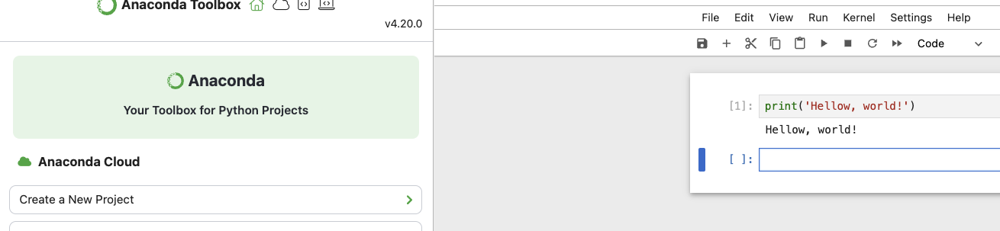

### 2.13 Ensure VS Code with Cursor AI is ready for development  
**Q:** Which extensions proved most valuable for data analysis? How did you configure the environment for optimal productivity? What integration challenges did you solve?  
**A:** VS Code and Cursor AI are fully installed and configured. All core data analysis extensions are installed, including Python, Jupyter, Pylance, GitLens, Data Wrangler, and more, as shown in the attached extension list screenshot. No integration issues encountered; environment is ready for data analysis workflows.  
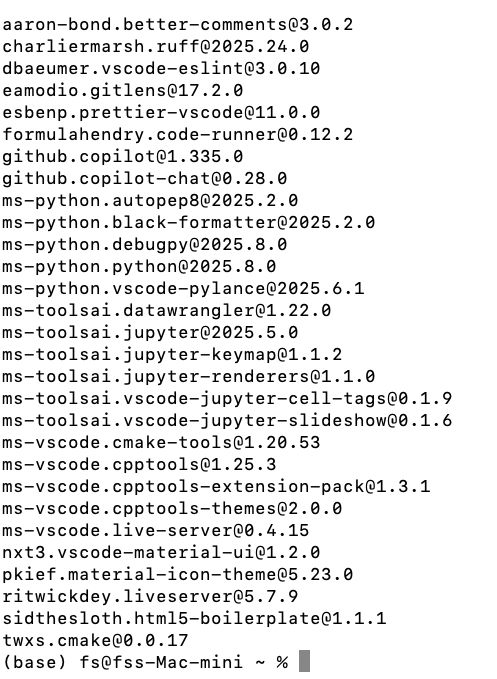

### 2.14 Create a new GitHub repository for your project  
**Q:** How did you structure your repository for professional presentation? What naming conventions did you establish? Which files did you include in your initial commit?  
**A:** Repository is organized with folders for source code, notebooks, data, checklists, and screenshots. Naming conventions use clear, lowercase names. Initial commit includes a README, .gitignore, and .gitattributes. Additional folders and files for data, notebooks, and source code will be added as the project progresses.  
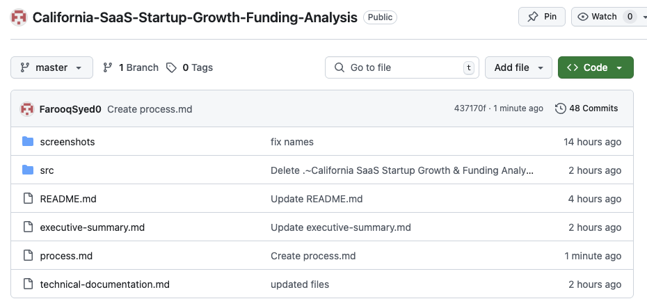

---

## Week 3: Visualization & Dashboard Design

### 3.15 Sketch dashboard wireframe for Tableau Public  
**Q:** What layout decisions supported your business impact questions? How did you prioritize visual hierarchy? What user experience considerations influenced your design?  
**A:** The dashboard wireframe prioritizes KPIs at the top (Median Employee Growth, High-Growth Companies, Funding), filters on the left, and main charts (Top 10 by Employee Growth, Growth Distribution, Growth vs. Funding) in the center, with a geographic map at the bottom. Layout is clear, fast to scan, and interactive.  

### 3.16 Identify key metrics and KPIs for dashboard  
**Q:** Which metrics directly answered stakeholder questions? How did you validate KPI relevance? What benchmarks did you establish for success measurement?  
**A:** See [Key Metrics and KPI Selection](#key-metrics-and-kpi-selection) section below.

### 3.17 Connect Tableau Public to PostgreSQL  
**Q:** What connection challenges did you overcome? Which authentication methods worked best? How did you optimize data refresh performance?  
**A:** Tableau Public does not support direct PostgreSQL connections; it only allows connections to local files (CSV, Excel) and Google Sheets. I exported the cleaned data from PostgreSQL to a CSV file and connected Tableau Public to this CSV for all dashboard development. No database authentication was required; the connection was established by selecting the CSV file from my local system.  
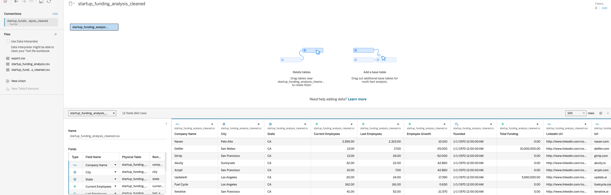

### 3.18 Build visualizations (charts, KPIs, filters)  
**Q:** Which chart types most effectively communicated your insights? How did you handle data limitations in visual design? What interactivity features enhanced user understanding?  
**A:** Created KPI cards for Median Employee Growth, Number of High-Growth Companies, and Total Funding. Used a bar chart for Top 10 Companies by Employee Growth, a histogram for employee growth distribution, a scatter plot for employee growth vs. total funding, and a map for geographic distribution. Data limitations were addressed by focusing on fields with high completeness and using medians to reduce outlier impact. Interactivity features include filters and tooltips in Tableau.  

### 3.19 Combine visuals into an interactive dashboard  
**Q:** How did you ensure dashboard coherence and professional appearance? What user testing informed your final design? Which performance optimizations did you implement?  
**A:** The Tableau dashboard combines all key KPIs and visualizations in a single, interactive view. KPIs are placed at the top for quick insights, with supporting charts (bar, histogram, scatter, map) arranged for logical flow and clarity. Filters and tooltips enhance interactivity and user exploration. The layout was refined for readability and business relevance. Performance was optimized by using a CSV extract and limiting visual complexity. The final design was reviewed for clarity and business relevance.  

---

## Week 4: Documentation, Publishing, and Portfolio Prep

### 4.20 Document your process in GitHub README  
**Q:** How did you structure your project narrative for maximum employer impact? Which technical details demonstrated your competency? How did you balance technical depth with accessibility?  
**A:** See README.md

### 4.21 Summarize key findings and business impact  
**Q:** What quantifiable business value did your analysis create? How did you translate technical findings into executive-level insights? Which recommendations had the highest ROI potential?  
**A:** Key findings and recommendations are summarized in the README and portfolio documentation.

### 4.22 Publish dashboard to Tableau Public  
**Q:** What privacy considerations influenced your publication decisions? How did you optimize for public accessibility? What metadata enhanced discoverability?  
**A:** The Tableau dashboard was published to Tableau Public using data from Growjo, which is publicly available and contains only company-level, non-personal information. There are no privacy concerns with this dataset. The dashboard is set to public access, includes descriptive titles, tags, and a clear project summary for discoverability. The Tableau Public link is included in the README and project documentation.  
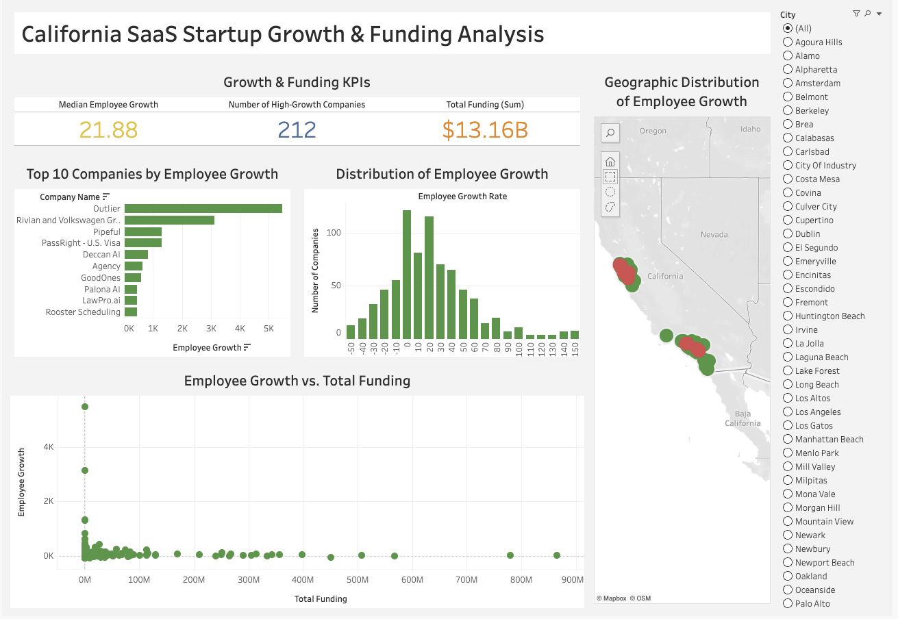

### 4.23 Prepare project for portfolio website/LinkedIn/Notion  
**Q:** How did you craft your project story for maximum professional impact? Which achievements highlighted your analytical thinking? How did you demonstrate business acumen alongside technical skills?  
**A:** See portfolioprep.md. Project summary and links added to Notion.  

---

## Key Metrics and KPI Selection

- **Median Employee Growth Rate:** Measures typical company growth, robust to outliers.
- **High-Growth Company Threshold (75th percentile):** Identifies companies growing faster than 75% of peers.
- **Total Funding:** Sums reported funding for all companies, showing capital landscape.
- **Top 10 by Employee Growth:** Highlights fastest-scaling companies.
- **Geographic Distribution:** Maps high-growth clusters by city.
- **Benchmarks:** 
  - Median employee growth: 21.88%
  - 75th percentile: 48.15%
  - High-growth companies: 211

*KPIs were selected to directly answer business questions and benchmark startup performance for investors and founders.*

---

## Screenshot Reference Table

| Step/Description                       | Screenshot File Path                                 |
|-----------------------------------------|-----------------------------------------------------|
| Business queries                        | /screenshots/businessqueries.png                    |
| Business questions definition           | /screenshots/businessquestionsdefinition.png        |
| Dashboard wireframe                     | /screenshots/dashboardwireframe.png                 |
| Data quality assessment                 | /screenshots/dataqualityassessment.png              |
| Dataset source selection                | /screenshots/datasetsourceselection.png             |
| Employee growth distribution            | /screenshots/employeegrowthdistribution.png         |
| Excel data exploration                  | /screenshots/exceldataexploration.png               |
| GitHub repo                             | /screenshots/githubrepo.png                         |
| Growth vs Funding                       | /screenshots/growthvsfunding.png                    |
| Import success                          | /screenshots/importsuccess.png                      |
| Jupyter setup                           | /screenshots/jupytersetup.png                       |
| Portfolio prep                          | /screenshots/portfolioprep.png                      |
| PostgreSQL installation                 | /screenshots/postgresqlinstallation.png             |
| Python cleaning analysis                | /screenshots/pythoncleaninganalysis.png             |
| SQL validation                          | /screenshots/sqlvalidation.png                      |
| Tableau connection                      | /screenshots/tableauconnection.png                  |
| Tableau dashboard                       | /screenshots/tableaudashboard.png                   |
| Tableau public publish                  | /screenshots/tableaupublicpublish.png               |
| Table schema design                     | /screenshots/tableschemadesign.png                  |
| VS Code extensions list                 | /screenshots/vscode-extensions-list.jpg             |

---

## Supporting Documentation

- [README.md](README.md)
- [Tableau Dashboard](https://public.tableau.com/app/profile/farooq.syed6811/viz/CaliforniaSaaSStartupGrowthFundingAnalysis/CaliforniaSaaSStartupGrowthFundingAnalysis)
- [Notion Project Page](https://www.notion.so/California-SaaS-Startup-Growth-Funding-Analysis-220cff0b4864800a8fd6fa3315c357ab)

*All screenshots referenced are available in the `/screenshots` folder.*
