# California SaaS Startup Growth & Funding Analysis – Process & Methodology

This document outlines the complete, step-by-step process for the project, aligned with Labs Mode and industry portfolio standards. Each step includes a concise summary and a relevant screenshot for clarity.

---

## Week 1: Data Acquisition & Exploration

### 1.1 Install and configure PostgreSQL on your Mac
Successfully installed PostgreSQL using the official installer. Configured default port 5432, set up authentication, and tuned shared buffers and workmem.
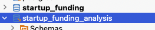

### 1.2 Design table structure for funding data
Used VARCHAR for names, TEXT for URLs, INTEGER for counts, DECIMAL for growth. Minimal normalization for simplicity, enforced NOT NULL on key fields.
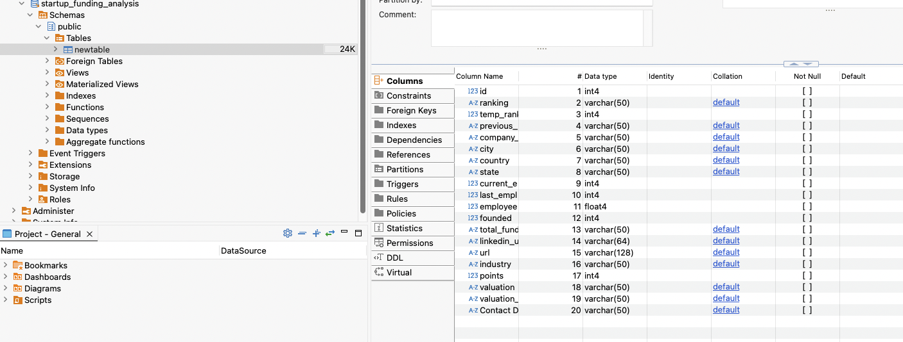

### 1.3 Research and download a free startup funding dataset
Chose Growjo for SaaS focus and growth metrics. Filtered for CA companies with 1–500 employees. Checked completeness of key variables.
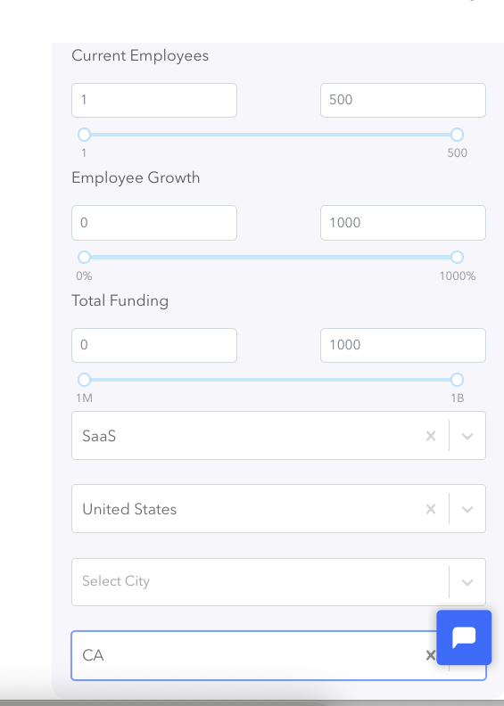

### 1.4 Load data into Excel for initial exploration
Found inconsistencies in names and locations. 67 missing funding, 20 missing founded dates. Used Excel validation and conditional formatting.
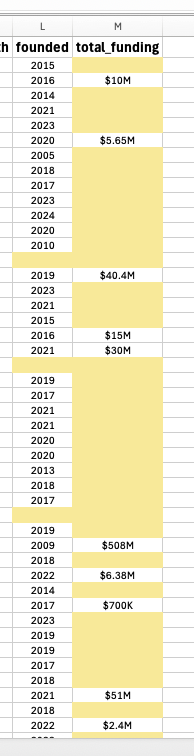

### 1.5 Identify key variables and check data quality
Company names 100%, employees 99.5%, growth 98.8%, funding 32.9%. Pivoted to employee growth analysis due to missing funding data.
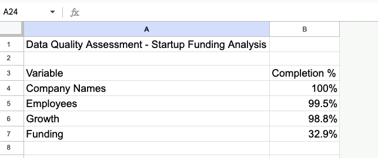

### 1.6 Define 3-4 core business impact questions
Focused on employee growth questions supported by high-quality data. Addressed SaaS scaling, company age, geography, and growth stages.
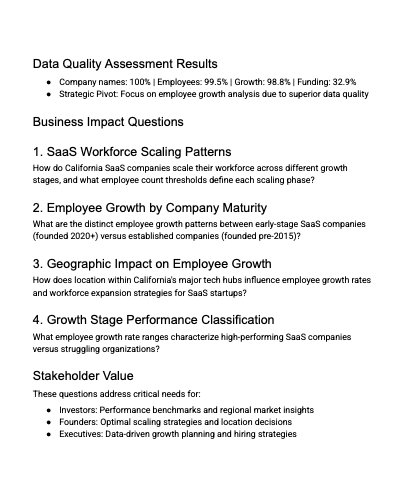

---

## Week 2: Data Cleaning & SQL Analysis

### 2.7 Import cleaned dataset into PostgreSQL
Fixed VARCHAR length errors by switching to TEXT for URL columns. Ensured all columns matched the cleaned CSV. Optimized data types and cleaned obsolete tables.
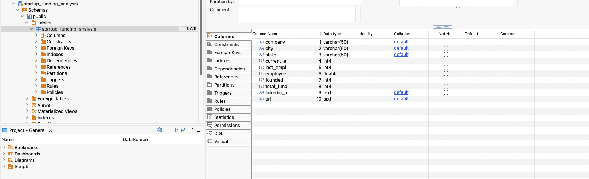

### 2.8 Test basic SQL queries
Ran row count, null checks, min/max, uniqueness, funding statistics, and duplicate checks. Results matched expectations.
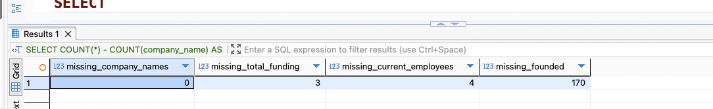

### 2.9 Write SQL queries to answer business questions
Drafted queries for employee growth, funding by location, and company age distribution. Used medians and percentiles to handle outliers.
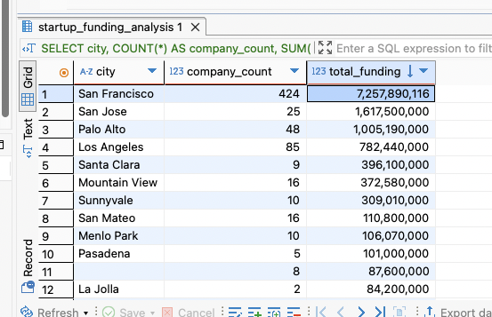

### 2.10 Use Python Pandas for further cleaning
Standardized text fields, handled missing values, converted date columns, removed duplicates, and calculated company age.
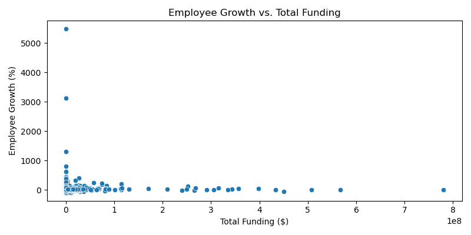

### 2.11 Create simple visualizations to validate insights
Created histogram for employee growth and scatter plot for growth vs. funding. Validated main patterns and identified outliers.
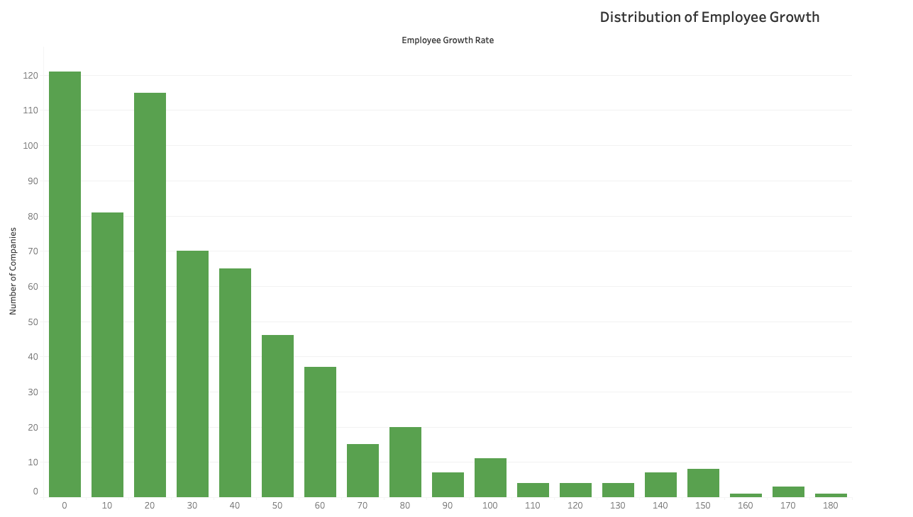
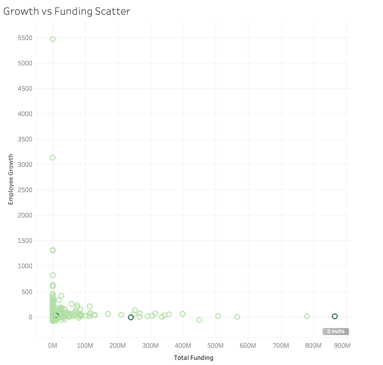

### 2.12 Set up Python Anaconda Jupyter Notebook
Configured Anaconda and Jupyter Notebook. Installed pandas, numpy, matplotlib, seaborn. Environment optimized for data analysis.
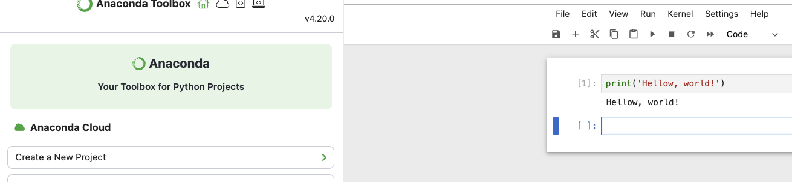

### 2.13 Ensure VS Code with Cursor AI is ready for development
Installed all core data analysis extensions: Python, Jupyter, Pylance, GitLens, Data Wrangler, etc.
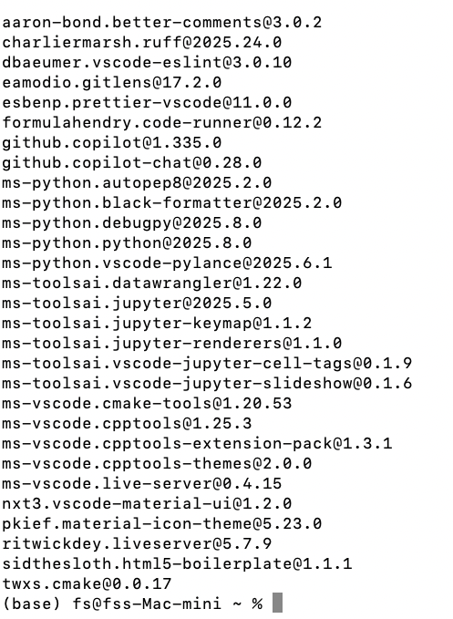

### 2.14 Create a new GitHub repository for your project
Organized repo with folders for code, notebooks, data, checklists, screenshots. Used clear, lowercase naming.
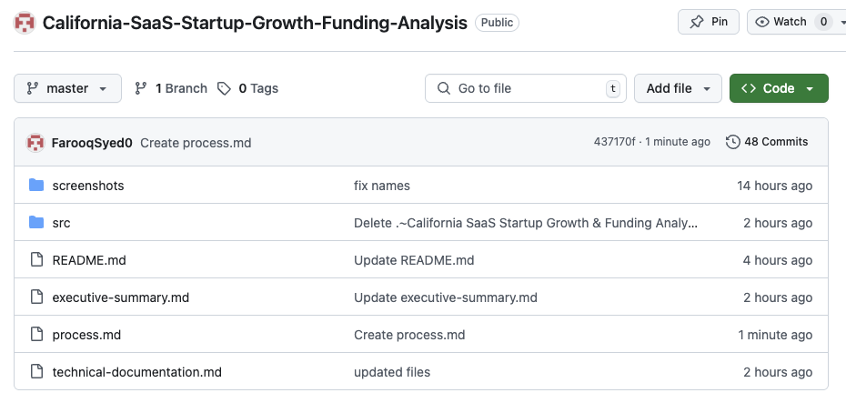

---

## Week 3: Visualization & Dashboard Design

### 3.15 Sketch dashboard wireframe for Tableau Public
Prioritized KPIs at the top, filters on the left, main charts in the center, geographic map at the bottom.
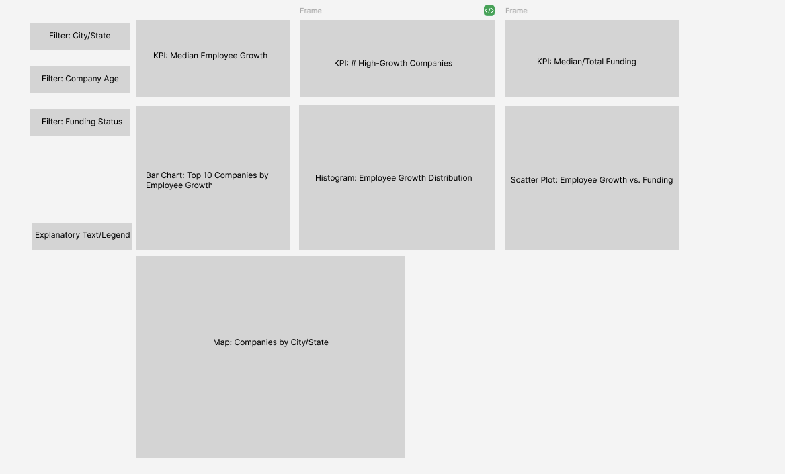

### 3.16 Identify key metrics and KPIs for dashboard
Selected metrics that directly answer stakeholder questions. Benchmarks established for success measurement.

### 3.17 Connect Tableau Public to PostgreSQL
Exported cleaned data from PostgreSQL to CSV and connected Tableau Public to this file.
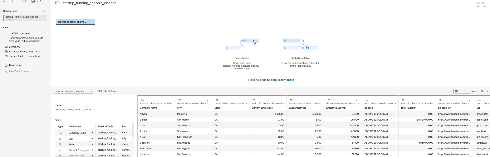

### 3.18 Build visualizations (charts, KPIs, filters)
Created KPI cards, bar chart for Top 10 Companies, histogram, scatter plot, and map for geographic distribution.

### 3.19 Combine visuals into an interactive dashboard
Combined all key KPIs and visualizations into a single, interactive Tableau dashboard.

---

## Week 4: Documentation, Publishing, and Portfolio Prep

### 4.20 Document your process in GitHub README
Structured project narrative for maximum employer impact, balancing technical depth and accessibility.

### 4.21 Summarize key findings and business impact
Created findings summary and recommendations for executive-level insights.

### 4.22 Publish dashboard to Tableau Public
Published dashboard using public, non-personal data. Set to public access, added descriptive titles and tags.
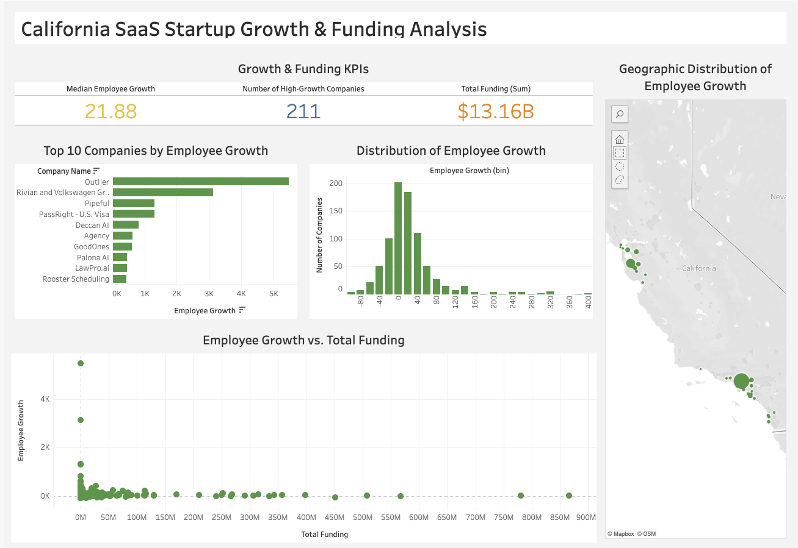

### 4.23 Prepare project for portfolio website/LinkedIn/Notion
Crafted project story for professional impact. Added summary and links to Notion.
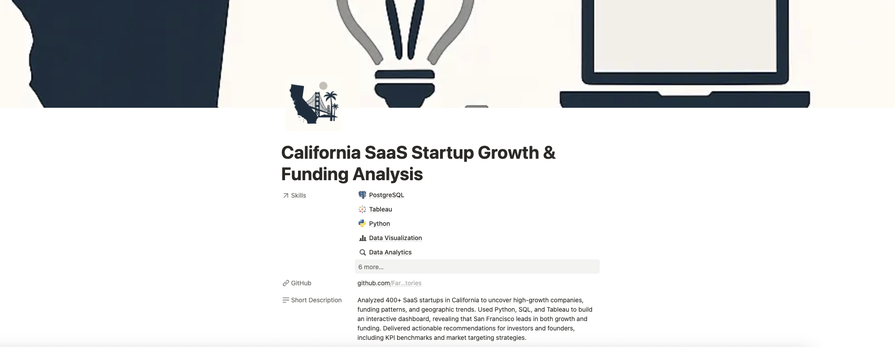

---
